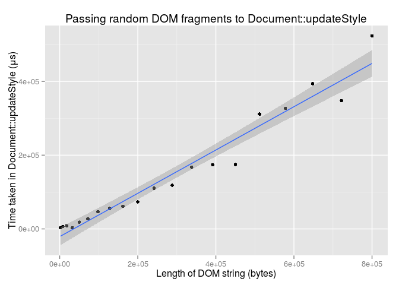
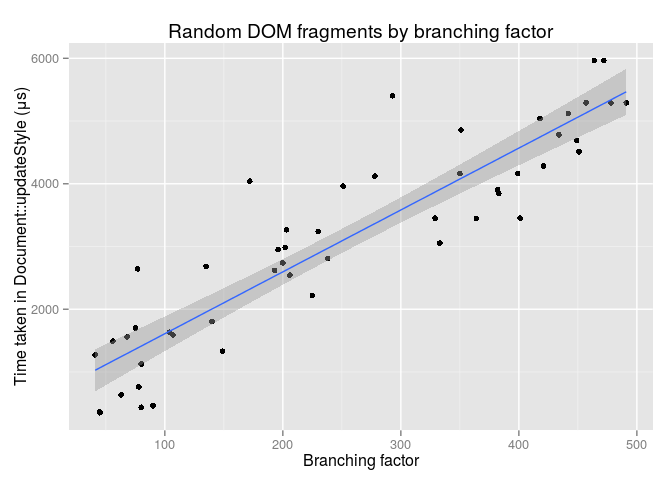
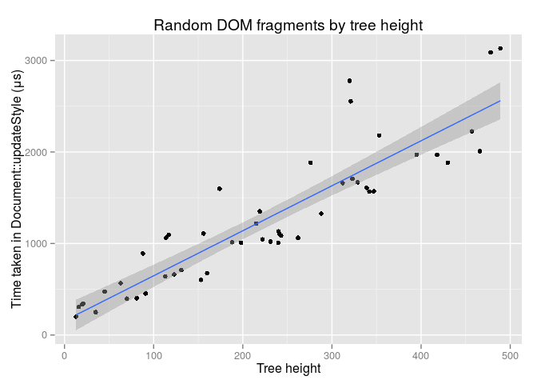

# Style engine performance experiments
Chris Wong  
December 16, 2015  

For the first experiment, the author generated random DOM fragments, and measured the time taken to call `Document::updateStyle`. 20 samples were collected in total.

Update times fit a linear regression model with intercept -20838.41 and slope 0.5869924. The correlation coefficient is 0.9770222, suggesting a very strong correlation.

 

# Varying branching factor

In the next experiment, the HTML fragments had a flat structure with no nesting. 50 samples were collected in total.

As before, the update time increased linearly with the number of nodes.

 

# Varying tree height

In the final experiment, the fragments had a deeply nested structure. All nodes, except the innermost leaf node, had exactly one child. 50 samples were collected in total.

Again, the growth was linear.

 
