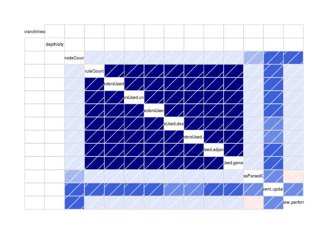
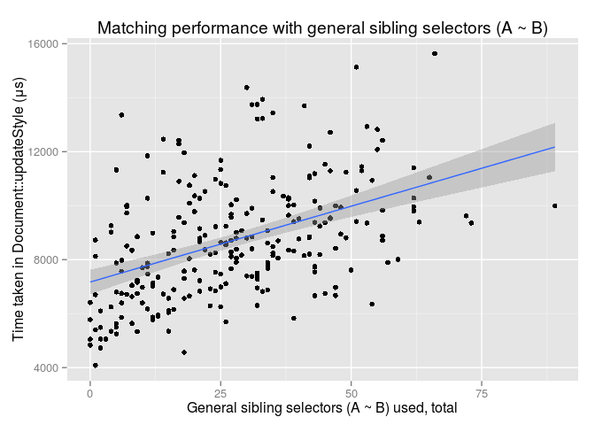
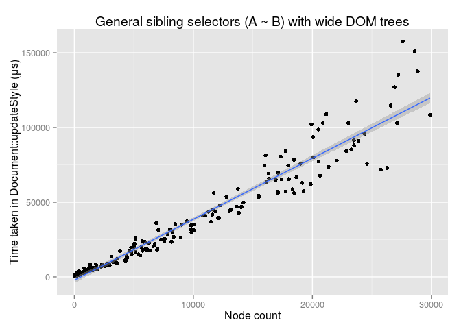
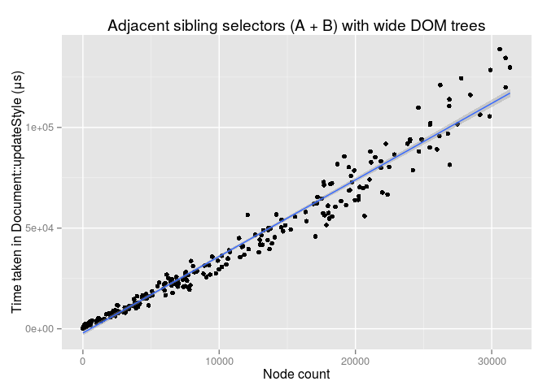
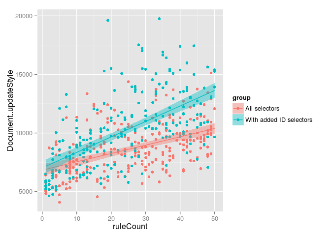
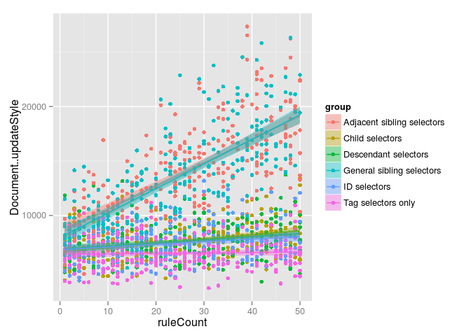

# Style engine performance experiments
Chris Wong  
December 16, 2015  

# Initial experiments

For the first experiment, the author generated random DOM fragments, and measured the time taken to call `Document::updateStyle`. These fragments had no CSS styling, other than the defaults provided by the browser. 20 samples were collected in total.

Update times fit a linear trend with intercept -20838.41 and slope 0.5869924. The correlation coefficient is 0.9770222, suggesting a very strong correlation.

 

## Varying branching factor

In the next experiment, the HTML fragments had a flat structure with no nesting. 50 samples were collected in total.

As before, the update time increased linearly with the number of nodes.

 

## Varying tree height

In the final experiment, the fragments had a deeply nested structure. All nodes, except the innermost leaf node, had exactly one child. 50 samples were collected in total.

Again, the growth was linear.

 

# Selector matching

Next, I modified the generator to add CSS rules as well. The generator supported the following selector types:

* Universal selectors, `*`
* Tag selectors, `foo`
* ID selectors, `#bar`
* Descendant selectors, `A B`
* Child selectors, `A > B`
* Adjacent sibling selectors, `A + B`
* General sibling selectors, `A ~ B`

Class selectors (`.baz`) were not included due to lack of time. But since they follow a similar code path to ID selectors, we can assume that they have similar performance properties. Future work should test this assumption.

For these experiments the focus was on selector matching, so the body of each rule was set to `opacity: 0.99`. The `opacity` property was chosen so that noise from layout and painting was kept to a minimum. 250 samples were collected in total.

Looking at the corrgram, there is a moderate correlation (r = 0.47124, p < 3.1086245\times 10^{-15}) between the number of CSS rules and the style update time:

 

The dark region in the middle corresponds to the counts for each individual selector type. Since the number of selectors (of any type) grows with the total number of CSS rules, all of these metrics should be correlated with each other.

If we take a look at one of the selector types -- general sibling selectors for example -- we see a clear linear trend (r = 0.447331, p < 1.0547119\times 10^{-13}):

 

## Sibling selectors and DOM branching factor

Both adjacent sibling (`+`) and general sibling (`~`) selectors have a reputation for being slow. In particular, since a general sibling selector needs to check *all* the siblings before the current node, the time to match this selector should grow quadratically with the number of nodes in total.

The data confirms this idea. The time to match general sibling selectors fits a linear regression model on the square of the DOM branching factor (p < 0).

 

Surprisingly, adjacent sibling selectors follow a quadratic trend as well (p < 0).

 

## Adding more classes and IDs

At first, it was thought that adding more class or ID selectors to a rule would speed up matching. The reasoning was: by placing these more efficient selectors front and center, we can filter out the majority of rules before they trigger the slower ancestor and sibling traversal code.

This hypothesis turned out to be false. In fact, adding more ID selectors made matching slower (p < 6.0582235\times 10^{-8}):

 

## Comparing different selector types

Next, I ran six experiments, each exercising a single selector type. Class selectors were not tested since the generator did not support them, but they should behave in a similar way to ID selectors.

I found that these selectors can be split into three categories based on performance:

1. Tag selectors (fastest)
2. ID, child, and descendant selectors
3. Sibling selectors (slowest)

This split can be seen in the plot below:

 

It is interesting to note that general sibling selectors are about as fast as their adjacent counterparts.

Child and descendant selectors having similar properties is interesting as well, though it is unclear whether this is true in general or specific to this experiment. The HTML fragments used here have a maximum tree depth of 2, so the engine does not have to search far to match a descendant selector.

Running the Mann-Whitney U test, we can be very confident (p < 5.2526257\times 10^{-9}) that tag selectors and ID selectors have different performance properties, and extremely confident (p < 3.2660848\times 10^{-64}) with ID selectors and sibling selectors as well.

## Conclusions

These results confirm the usual advice to favor classes and IDs over more complex selectors. But the speed of descendant selectors may seem counterintuitive. According to [Sullivan (2011)][1], optimizations such as ancestor filters and fast paths have made descendant selectors more efficient than intuition would suggest.

[1]: http://calendar.perfplanet.com/2011/css-selector-performance-has-changed-for-the-better/
